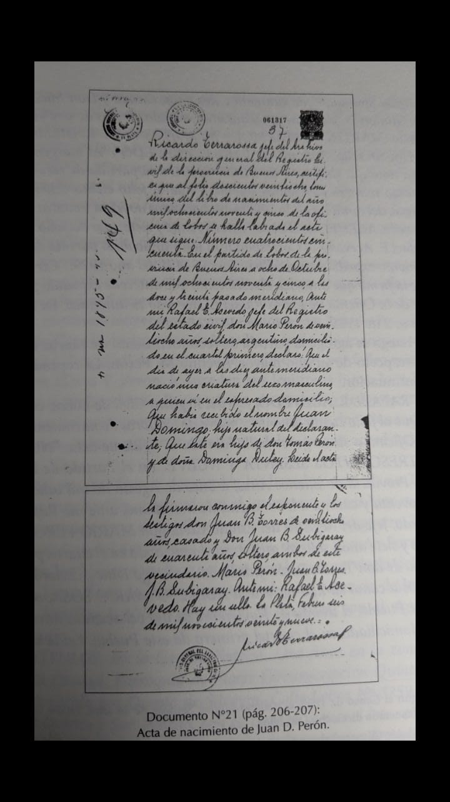

# Trámite ordinario del sucesorio de Mario T. Perón

El juicio sucesorio fue caratulado Perón, Mario Tomás s/sucesión, año 1928, Expediente No 12.999, Folio 163, y se tramitó ante el Juzgado Civil N° 2 de la Capital Federal, a cargo del doctor Ramón Porcel de Peralta, Secretaría Nº 12 del doctor Adrián Fernández Mouján, Agente Fiscal Franklin Barroetaveña.

A fojas 2 del expediente sucesorio obra el poder extendido por la familia Perón-Sosa que dice:

> ESCRITURA NUMERO QUINIENTOS SIETE: En la Ciudad de Buenos Aires Capital de la República Argentina a veintitrés de Noviembre de mil novecientos veintiocho, ante mi CARLOS FRAGUEIRO TERRY Escribano Público y los testigos al final firmados comparecen en su domicilio calle Lobos número tres mil doscientos cincuenta y nueve, donde me encuentro constituido a su requerimiento, la señora JUANA SOSA de PERÓN viuda;
> Don AVELINO MARIO PERÓN que firma "Mario A. Perón", casado y Don JUAN DOMINGO PERÓN que firma "Juan Perón", soltero mayores de edad, de mi conocimiento doy fé y dicen:
> Que confieren PODER ESPECIAL al Doctor ALEJANDRO S. CLOPPET, para que inicie y prosiga hasta su total terminación la sucesión de Don Mario Tomás Perón.
> ...Leída y ratificada firman por ante mí y los testigos Don Samuel Toranzo y Don Jesús J. Ferreyra, vecinos y hábiles doy fé. JUANA S. de PERON. MARIO A. PERON. JUAN PERON.- Tgo: SAMUEL TORANZO.- Tgo: JESUS J. FERREYRA.
> Hay un sello.
> Ante mi CARLOS FRAGUEIRO TERRY.
> CONCUERDA con su matriz doy fé.
> Para el apoderado expido el presente que rubrico, sello y firmo en el lugar y fecha de su otorgamiento.
> Raspado. A Perón- practiquelos demás. Vale. Fdo. Carlos Fragueiro Terry".

A continuación transcribiré las partes y documentos del sucesorio mencionado que me parecen más destacadas. 
Lo actuado por Alejandro S. Cloppet (Matrícula Folio 228 Libro 6º de la Corte Suprema de Justicia de la Nación) incluye las primeras ciento treinta y cuatro (134) fojas útiles, 
las cuales resultan más interesantes en lo que concierne a los datos existentes sobre el nacimiento de Juan D. Perón y los bienes que pertenecían a su familia.

Del mismo modo quiero señalar que actualmente ese expe- diente tiene dos (2) cuerpos, con trescientas cincuenta y nueve (359) fojas útiles en trámite en el actual Juzgado Nacional de Primera Instancia en lo Civil Nº 90, 
Secretaría Única, ubicado en el 4º piso de Avenida de los Inmigrantes 1950 de la Ciudad Autónoma de Buenos Aires, y por lo que tengo entendido se encuentra reservado en la caja fuerte del tribunal, 347

El escrito de inicio del juicio sucesorio ab-intestato de Mario T. Perón fue presentado y firmado por Alejandro S. Cloppet como apoderado de Juana Sosa de Perón, Avelino M. Perón y Juan D. Perón, el día 4 de diciembre de 1928, a las trece (13) horas. De ese escrito de inicio surge la competencia de los tribunales

de la Capital Federal, al decir que:

"El causante falleció en esta Capital, en su domicilio, Calle Lo- bos N° 3259 el 10 de Noviembre del corriente año, no conociéndole testamento alguno, todo lo cual resulta del certificado de defunción que, expedido en legal forma acompañо".

La partida de defunción debidamente timbrada y agregada a fojas 1 que transcribimos fielmente reza así:

> "Buenos Aires, Noviembre 27 de 1928. Carlos Jeanes Piñeiro Jefe de la Sección Quinta del Registro Civil de la Capital,
> Certifica que en el tomo segundo de los libros de defunciones de esta Sección Quinta existe un acta que dice así:
> Número mil ciento cincuenta y siete.
> En la Capital de la República Argentina á once de Noviembre de mil novecientos veintiocho ante mí Jefe de la Sección Quinta del Registro Fernando Hernández
> de treinta y dos años, casado, domiciliado Córdoba mil ochocientos declaró que ayer á las ocho horas y treinta en Lobos tres mil doscientos cincuenta y nueve falleció MARIO TOMÁS PERÓN
> de parálisis biblar según certificado del médico H. Scooticati...
> que era de sexo masculino de sesenta y un años argentino hacendado domiciliado donde falleció, hijo de Tomás Perón, argentino fallecido y de Dominga Dutey, argentina
> domiciliado Bolivia trescientos setenta y siete y casado con Juana Sosa.
> Se ignora si testó.
> Leído el acta lo firmaron conmigo el declarante y el testigo Carlos Alberto Martino de treinta y cinco años soltero domiciliado Castro mil quinientos cuarenta quienes han visto el cadáver.
> Fernando Hernández - Carlos A. Martino - Carlos Jeanes Piñeiro
> - Hay un sello -
> A pedido de Alejandro Santiago Cloppet,
> expido el presente que sello y firmo en Buenos Aires, fecha ut retro.
> Fdo. Carlos Jeanes Piñeiro"
> - Partida de Defunción Nº 10.
> - Municipalidad de la Ciudad de Buenos Aires, Buenos Aires 27 de noviembre de 1928, Sección Treinta del Registro Civil de la Capital, Tomo Segundo.

Más adelante se confirma que estaba legítimamente casado con Juana Sosa, cuyo matrimonio se había segurado en esta Capital Federal el día 25 de Septiembre de 1901, 
según consta en la partida de matrimonio Nº 0675, Municipalidad de ciudad de Buenos Aires, 
Buenos Aires 27 de noviembre de 1928, Tomo Tercero de los Libros de Matrimonios de la Sección Quinta, que luce a fojas 3 y 4. 

> "Buenos Aires, Noviembre 27 de 1928.
> El Jefe del Archivo del Registro Civil de la Capital,
> Certifica: que en el tomo tercero de los libros de Matrimonios de la Sección quinta existe un acta que dice así:
> Número Setscientos cuatro: En la Capital de la República á vein te y cinco de Setiembre de mil novecientos uno á la una de la tarde comparecieron ante mi Jefe de la Quinta Sección del Registro:
> Mario Tomás Perón de treinta y tres años soltero argentino nacido en ésta Capital empleado, domiciliado Azcuénaga doscientos catorce, hijo de Tomás Perón argentino fallecido, y de Dominga Dutey oriental rentista,
> domiciliada Cuyo mil doscientos cincuenta y uno y, Juana Sosa de veinte y seis años soltera argentina nacida en Lobos Provincia de Buenos Aires quehaceres domésticos
> domiciliada Azcuénaga doscientos catorce hija de Juan Sosa argentino fallecido y de Mercedes Toledo argentina domiciliada en Lobos;
> y me manifestaron que querían desposarse en presencia de los testigos:
> Antonio Segundo Petrocchi de veinte y ocho años soltero empleado domiciliado
> Cuyo mil doscientos cincuenta y uno, y Ermidio Thiers Posse de veinte y tres años casado comerciante domiciliado Anchorena trescientos treinta y ocho:
> quienes declararon que respondían de la identidad de los futuros esposos y los creían hábiles para contraer matrimonio.
> No habiéndose producido oposición y previo consentimiento prestado en forma por los contrayentes declaré en nombre de la Ley que:
> Mario Tomás Perón y Juana Sosa, quedaban unidos en matrimonio.
> En éste acto los esposos reconocieron como hijos suyos, á Avelino Mario, y Juan Domingo, nacidos en Lobos, el treinta de Noviembre de mil ochocientos noventa y uno;
> y ocho de octubre de mil ochocientos noventa y cinco.
> Leída el acta la firmaron conmigo los esposos y los testigos en ella indicados.
> Mario T. Perón. Juana Sosa. Ermidio Thiers Posse. A. S. Petrocchi. Gastón P. Fenillant.
> Hay un sello.
> A pedido de parte interesada expido el presente que firmo y sello en Buenos Aires fecha ut-supra".

Los bienes dejados por el causante en vida y que entraron en sucesión fueron los siguientes:

Propios: 
1. Un terreno ubicado en Roque Pérez, (Provincia de Buenos Aires), designado en el plano especial con el número 1 de la manzana 14, compuesto de una superficie de mts. cuadrados 2.020, 50 cms.

Gananciales: de la sociedad conyugal con D. Juana Sosa. 
1. Una legua de campo, o sea 2.500 hectáreas en el Territorio Nacio- nal del Chubut; fue adquirido por el causante, al Gobierno de la Nación, según Decreto de 25 de Noviembre de 1924;
2. Las haciendas lanares y yeguarizas que pueblan el campo aludido, en el Chubut. Asimismo los correspondientes boletos de marca y señales, propiedad del causante;
3. Su parte de condómino, que representa un cincuenta por ciento pro indiviso en una bóveda en el Cementerio del Oeste (Chacarita). Dicha bóveda fue adquirida en común con D. Dominga Dutey de Perón, madre del causante, el 16 de Noviembre de 1914, quien, por sí y en representación de su hijo, D. Mario Tomás Perón, en ejercicio del poder general que éste le tenía conferido, compró a D. Pellegrino Bruzzone, por la suma de $ 8.800 m/n., la bóveda y subsuelo de propiedad de éste, la cual se halla edificada sobre los lotes 24 y 25, número 5, man- zana 9, sección 9, del referido Cementerio del Oeste de la Capital;
4. Una casa situada en la calle Lobos Nº 3259, que compró al se- ñor Manuel Marcelo Pérez Racedo. Dicha finca está situada en la Zona Sud de esta Ciudad, Parroquia de Flores, circunscripción 5ª, paraje conocido por "Quinta de Silveyra";
5. Depósito en el Banco de la Nación Argentina (Agencia Flores), que al 30 de Septiembre del corriente año, ascendía a la suma de $ 111,89 m/n.

Del expediente sucesorio también se desprende la denuncia -en forma pormenorizada- de las deudas existentes al momento del fallecimiento del causante, que consistían en:

> Una hipoteca de la finca Calle Lobos 3259 a favor de D. Manuel Marcelo Pérez, domiciliado en la calle Maure Nº 2187, por la suma de $ 10.000 m/n.,
> en el momento de su constitución (y que habiendo sido pagada parcialmente adeudaría en consecuencia la cantidad de $ 3.057,52 m/n);
> gastos de farmacia durante la última enfermedad del causante, según factura de la Farmacia Finocchiaro, Calle Quirno Nº 3302, $ 276,60 m/n.-;
> importe de la tasa de pavimentación adeudado por la finca Calle Lobos 3259, propiedad del causante, $ 1.612,66 m/n.

> En consecuencia, el total de lo adeudado por el causante ascendía, excepto error u omisión, a la suma de cuatro mil novecientos cuarenta y seis pesos, con setenta y ocho centavos moneda nacional ($ 4.946,78 m/n.).

> Dado que los bienes dejados por el causante eran propios y gananciales, sus herederos intervinieron en el juicio sucesorio en el siguiente carácter: 
> D. Juana Sosa de Perón, su esposa, en carácter de cónyuge, sucediéndole en su bien propio, en una parte igual a la correspondiente a la de sus hijos legítimos, (artículo 3.570 del Código Civil); de los bienes gananciales, le corresponde la mitad (artículos 1.291 y 1.315 del Código Civil); 
> D. Avelino Mario y D. Juan Domingo Perón, en su carácter de hijos legítimos del causan- te (articulo 3.565 del Código Civil)".

Hasta aquí hemos transcripto parcialmente el escrito de inicio, que integra las fojas 22/24 de los autos principales. 

Guarda perfectamente las formas legales, y el Juez interviniente el 5 de diciembre de 1928 declaró abierto el juicio sucesorio de Mario T. Perón y mandó publicar edictos por el término de ley en el Boletín Judicial y el diario La Razón. Un detalle curioso es la propuesta que hace Alejandro S. Cloppet -de acuerdo a las precisas instrucciones recibidas de sus mandantes de designar administrador provisorio de los bienes hereditarios al cónyuge supérstite, Juana Sosa de Perón. 
Esta decisión resulta extraña debido a que era Juan D. Perón quien llevaba la voz cantante en la familia y no su señora madre.

Más adelante se cumplió con la obligación de presentar las partidas de nacimiento de los dos hijos del causante, que también fueron gestionadas por el letrado apoderado de la sucesión Alejandro S. Cloppet.

La primera, que se acumula (fojas 37/39), es la de Juan D. Perón. 
Por la importancia que reviste este documento -redactado en letra cursiva y a mano- lo transcribimos textual y fielmente:

> "Ricardo Terrarosa jefe del Archivo de la dirección general del Registro Civil de la provincia de Buenos Aires, certifica que al folio doscientos veintiocho, tomo único del libro de nacimientos del año mil ochocientos noventa y cinco
> de la oficina de Lobos se halla labrada el acta que sigue:
> Número cuatrocientos cincuenta.
> En el partido de Lobos de la provincia de Buenos Aires a ocho de octubre de mil ochocientos noventa y cinco, a las doce y treinta pasado meridiano,
> Ante mí Rafael E. Acevedo351 jefe del Registro del estado civil,
> don Mario Perón de veintiocho años, soltero, argentino, domi- ciliado en el cuartel primero, declaró:
> Que el día de ayer a las diez ante meridiano nació una criatura del sexo masculino, a quien vi ant el expresado domicilio;
> Que había recibido el nombre de JUAN DOMINGO: hijo natural del declarante,
> Que éste era hijo de don Tomás Perón y de doña Dominga Dutey.
> Leída el acta la firmaron conmigo el exponente y los testigos
> don Juan B. Torressi de vein tiocho años, casado y
> don Juan B. Subigaray's de cuarenta años, soltero, ambos de este vecindario.
> Mario Perón - Juan B. Torres - 1. B. Subigaray -
> Ante mí: Rafael E. Acevedo.
> Hay un sello.
> La Plata, Febrero seis de mil novecientos veinte y nueve.-
> Fdo. Ricardo Terrarosa".

Esta partida de nacimiento tiene la certificación de la firma y la rúbrica que manda la ley, dada en la ciudad de La Plata, a los seis (6) días del mes de febrero de 1929.

Inmediatamente se agregan a fojas 42/46 las partidas de nacimiento y la de reconocimiento de Abelino o Avelino Mario Sosa, después Abelino o Avelino Mario Perón, que están reproducidas en copia mecanografiada.

La del nacimiento de Avelino M. Perón dice textualmente así: RAFAEL E. ACEVEDO, Jefe del Registro Civil de Lobos, certifica: Que al folio doscientos ochenta y nueve de los libros de Nacimientos de esta Oficina a su cargo, se halla labrada la siguiente acta: 

> "NÚMERO QUINIENTOS SETENTA Y SIETE.
> En el Partido de Lobos de la Provincia de Buenos Aires, á tres de Diciembre de mil ochocientos noventa y uno, á las dos pasado meridiano, ante mí:
> Rafael E. Acevedo, Jefe del Registro del Estado Civil, Don Martin del Mármol, veintiocho años, soltero, Argentino, domiciliado en el cuartel primero, declaró:
> Que el día treinta del mes próximo pasado, á las nueve pasado meridiano, nació una criatura del sexo masculino, á quien vi en el expresado domicilio;
> que había recibido el nombre de ABELINO MARIO, hijo natural de Doña Juana Sosa, de diez y siete años, soltera, Argentina domiciliada en el cuartel primero;
> que esta era hija de Don Juan Sosa y de Doña Mercedes Toledo.
> Leída el acta la firmaron conmigo el exponente y los testigos Don Miguel Spinosa, de cuarenta y dos años, casado y
> Don Malcolm R. Gilmore, de cuarenta y dos años, casado, ambos de este vecindario.
> MARTIN del MÁRMOL - M. SPINOSA - M. R. GILMORE
> Hay un sello.
> Ante mí. RAFAEL E. ACEVEDO".

> "Al margen hay una nota que dice así:
> "CORRESPONDE á la partida de reconoci miento número trescientos sesenta y nueve, folio ciento ochenta y nueve, del tomo segundo, año mil ochocientos noventa y cuatro.
> Hay un sello.
> ACEVEDO.
> "Lobos Febrero veinte y siete, año del sello. Fdo. Rafael E. Acevedo".-
> Corresponde al testimonio de la partida de na- cimiento expedida en el sello número 34451 del año 1929.
> "Certifico que la firma que autoriza el testimonio que antecede expedido por el jefe de la Oficina de Lobos Rafael E. Acevedo es auténtico. La Plata marzo 2 de 1929. Fdo. Oliverio W. Caminos" 

Luego se agrega la partida de reconocimiento de Mario T. Pe- rón respecto de su hijo mayor, Avelino M. Perón. La reproduzco a continuación:

> "RAFAEL E. ACEVEDO, Jefe del Registro Civil de Lobos; certifica:
> Que al folio ciento ochenta y nueve de los libros de nacimientos de esta Oficina a su cargo, se halla labrada la siguiente acta:
> "NÚMERO TRESCIENTOS SESENTA Y NUEVE.
> En el Partido de Lobos de la Provincia de Buenos Aires, a once de Agosto de mil ochocientos noventa y cuatro, a las tres pasado meridiano,
> ante mí: Rafael E. Acevedo, Jefe del Registro del Estado Civil, don MARIO PERON, de veinte y siete años, soltero, argentino, domiciliado en el cuartel primero,
> hijo de don Tomás Perón y de doña Dominga Dutey, declaró:
> Que reconocía como su hijo natural a ABELINO MARIO SOSA, nacido en este Pueblo, el treinta de Noviembre de mil ochocientos noventa y uno, domiciliado en el cuartel primero de este Pueblo.
> Leída el acta la firmaron conmigo el exponente y los testigos don Juan B. Torres, de veinte y cinco años, soltero, y don Pedro Portillo, de veinte y siete años, soltero, ambos de este vecindario.-
> MARIO PERON. - JUAN B. TORRES-PEDRO PORTILLO.-
> Hay un sello.-
> Ante mi: RAFAEL E ACEVEDO"...
> Corresponde al testimonio de la partida de Nacimiento expedida en el sello número 71540 del año 1929.
> "Certifico que la firma que autoriza el testimonio que antecede expedido por el jefe de la Oficina de Lobos Rafael E. Acevedo es auténtica.
> La Plata marzo 2 de 1929.
> Oliverio W. Caminos".

Una vez que se cumplieron las minutas y trámites necesarios para superar la primera etapa prevista del juicio, el apoderado solicitó, conforme al derecho, que se dicte la declaratoria de herederos.

A continuación, el juez de primera instancia Ramón Porcel de Peralta dictó la declaratoria de herederos con un auto manuscrito de fecha 1º de abril de 1929. 
Allí se declaró que, por fallecimiento de don Mario T. Perón, le suceden sus legítimos hijos: Juan Domingo y Avelino Mario Perón y Sosa, 
sin perjuicio de los derechos que puedan corresponderle al cónyuge supérstite doña Juana Sosa de Perón, únicas personas que, como tales, se han acreditado en autos.

Una vez que fueron declarados los herederos de Mario T. Perón, la tramitación continuó con el inventario de sus bienes. 
Éste fue practicado por el escribano público Carlos Fragueiro Terry, por mandato del Señor Juez en lo Civil, doctor Ramón Porcel de Peralta; 
los bienes son denunciados por la señora viuda del causante, Juana Sosa de Perón, y practicado en presencia de los testigos, Amadeo P. Villa y de Víctor M. Galtieri, con el siguiente resultado:

> "TITULOS.
> 
> En la Capital Federal.
> Una finca en la zona Sud de esta Ciudad, Parroquia de Flores Circunscripción Quinta, parage conocido por Quinta de Silveyra, Calle Lobos N° 3259, entre las de Quirno y San Pedrito,
> con su terreno que es el lote señalado en el plano de título con el número 34 de la manzana letra E....
> Le correspondió al causante por compra que hizo a Don Manuel Marcelo Pérez y Racedo, por escritura de fecha veintiocho de Mayo de mil novecientos veinticinco ante el escribano Don Francisco Ratto,
> la que en testimonio fue inscripta en el Registro de la Propiedad, al Tomo doscientos veintidós, al folio quinientos cincuenta y cinco, número cuarenta un bajo n mil noventa y siete, inscripción tercera.
>
> TERRITORIO NACIONAL DEL CHUBUT.
>
> Título de propiedad otorgado a favor del causante por el Poder Ejecutivo de la Nación, con fecha veinticinco de Noviembre de mil novecientos veinticuatro, referente a un terreno de campo,
> con una superficie de Dos mil quinientas Hectáreas designado como legua B. del lote pastoril TRES, fracción A. Sección D 1, de las tierras destinadas a la colonización con familias de Sud-Africa, en el Territorio del Chubut...
> Inscripto el dominio a su nombre al Tomo Diez y ocho, folio trescientos treinta y siete. Zona Chubut, inscripción Primera.
>
> "PROVINCIA DE BUENOS AIRES.
> 
> Un lote de terreno, ubicado en el cuartel sexto del Partido de Saladillo, jurisdicción de la Provin- cia de Buenos Aires, inmediaciones de la Estación Roque Pérez,
> designado en el plano especial a que se refiere su título, con el número UNO de la manzana número Catorce, compuesto de una superficie de Dos mil veinte metros cuadrados...
> Correspondió al causante por compra que hizo a Don Bruno Gutiérrez 357 y otros, representados por Don Florentino M. García, por escritura pasada en el Pueblo de Lobos el diez y seis de Setiembre de mil ochocientos noventa y tres
> ante el Escribano de dicho Pueblo Don Rafael E. Acevedo.-
> Inscripto en el Registro de la Propiedad de la Ciudad de La Plata el trece de Octubre del mismo año,
> bajo el número veintitrés mil trescientos ochenta y cuatro, Serie B.
>
> UNA bóveda y subsuelo, en condominio con la señora Dominga Dutey de Perón, la que se halla edificada sobre los lotes 24 y 25, número cinco, manzana Nueve, Sección nueve, del Cementerio del Oeste de esta Capital.
> Le correspondió por compra a Don Pellegrino Bruzzone, por escritura de fecha 16 de noviembre de mil novecien- tos catorce, ante el Escribano Don Juan Antonio Soriva....-
>
> UN boleto de señal del Territorio del Chubut, Departamento Escalante, para hacienda menor expedido por el Juzgado de Paz de Comodoro Rivadavia, a favor de Don Mario Tomás Perón,
> habiéndose registrado la señal de dos muescas abajo la izquierda y dos muescas arriba la derecha.-
>
> OTRO boleto de señal, expedido por el Juzgado de Paz de Co- modoro Rivadavia, Gobernación del Chubut, Departamento de Escalante,
> para hacienda menor, habiéndose registrado la señal agujero y muesca abajo la izquierda y agujero y muesca arriba la derecha.-
> 
> Un boleto de marca N° 1729, expedido por el Jefe de Policía de Rawson Gobernación del Chubut, registrado a favor de Don Mario Perón, el 14 de Febrero de 1905, al folio 217. del Libro primero".

El inventario -agregado a fojas 57/59 del expediente sucesorio- lleva las rúbricas de Juana Sosa de Perón. de los testigos Ama- deo P. Villa y Víctor M. Galtieri, y del escribano público Carlos Fragueiro Ferry.

Es digno de considerarse que la tasación de esos bienes durante el trámite sucesorio fue realizada por un perito tasador nombrado por el juez interviniente: el ingeniero civil Marcelo M. Guttero, quien describió pormenorizadamente lo siguiente:

> "Que el día doce del corriente mes (abril de 1929), me trasladé al inmueble objeto de la pericia, ubicado en la calle Lobos Nº 3259 zona Sud de esta Ciudad, Parroquia de Flores, circunscripción 5°, paraje conocido por 'Quinta de Silveyra'.
> El terreno arriba mencionado tiene 8.66 m. de frente al Sudeste, por 33.54 m. de fondo en el costado Sudoeste y 33.53 m. en el opuesto Noreste, lo que hace una superficie de 290.41 metros cuadrados.
> Por la ubicación del mismo, sobre una calle con pavimento liso, cuyo costo adeuda en gran parte, a media cuadra de la calle San Pedrito, arteria importante en esa zona,
> la que se encuentra recorrida por autobús; a cuatro cuadras y media de la calle Rivadavia;
> estimo en diez y siete pesos el metro cuadrado lo que hace para el terreno el total de cuatro mil novecientos treinta y seis pesos con noventa y siete centavos ($4.936,97) moneda nacional.
> El edificio, cuya distribución es de tipo algo anticuada, consta como lo indica el croquis adjunto de dos dormitorios, un comedor, un bang cubierto ed una cocina y
> dos espaciosos patios descubierto uno y cubierto el otro.
> Los techos son de chapa ondulada de hierro galvanizado, la mampostería de cal, con excepción de los cercos que indica el croquis,
> los revoques y pinturas se encuentran en buen estado de conservación.
> Los dormitorios, comedor y pieza de servicio tienen pisos de pino tea y el baño, la cocina y los patios de mosaico encontrándose los pisos con excepción del de la cocina, en muy buen estado de conservación.
> La carpintería de tipo regular es de cedro con marcos de pino tea. Los servicios sanitarios están debidamente provistos y en buen estado de conservación.
> En consecuencia estimo el edificio en la suma de once mil quinientos pesos ($ 11.500.00) moneda nacional lo que hace para el conjunto de terreno y edificio la suma de diez y seis mil cuatrocientos treinta y seis pesos con noventa y siete centavos ($ 16.436,97) moneda nacional".

En el mismo informe pericial, el profesional realiza también una valuación de la bóveda:

> "Que el día trece del corriente mes (abril de 1929) me trasladé el Cementerio del Oeste y procedí a inspeccionar la bóveda objeto también de esta pericia;
> la que se encuentra situada en los lotes 24 y 25 número 5, manzana 9, sección 9 del referido cementerio,
> midiendo cada lote 1.25 m. de frente por 2.50 m. de fondo lo que da una superficie de seis metros cuadrados con veintiocho y avanzando debajo de la calle 0.60 m. lo que da una superficie de un metro cuadrado con cincuenta siendo el total, por consiguiente, de siete metros cuadrados con setenta y cinco.
> La bóveda se encuentra en muy buena posición, cerca de la entrada principal del Cementerio, edificada con cuidado posee frente de granito artísticamente trabajado y en su interior un altar con una adecuada decoración en mármol de Carrara.
> Tiene 24 catres repartidos en dos subsuelos y 2 catres en el altar lo que hace un total de veinte y seis catres siendo su estado de conservación muy bueno.
> Estimo por lo tanto en la suma de trece mil pesos moneda nacional ($ 13.000.00) la bóveda de referencia".

Seguidamente, luego de la firma del perito tasador, ingeniero civil Marcelo M. Guttero, incorporó un "otro si digo" con la estimación de sus honorarios: 
trescientos pesos moneda nacional ($ 300,00 m/n.). 
Respecto de la mentada tasación, el apoderado Alejandro S. Cloppet pidió su aprobación. 
Con relación a la estimación de los honorarios, por el contrario, expresó su disconformidad, por estimarlos elevados, teniendo en cuenta el monto de lo tasado y los trabajos efectuados.

Con posterioridad a los trámites de inventario y tasación de los bienes situados en la ciudad de Buenos Aires, Alejandro S. Cloppet impulsó, 
a través de un exhorto del Juez de Primera Instancia de la Capital de la República, 
al Juez Letrado del Territorio Nacional del Chubut, 
para que éste a su vez indujera al señor Juez de Paz de Comodoro Rivadavia a practicar un inventario de las haciendas y demás bienes existentes en el campo que perteneció a Mario T. Perón, 
situado en Camarones (Gob. del Chubut), que forma la Legua B. del lote pastoril tres, fracción A., Sección D. de las tierras destinadas a la colonización con familias de Sudáfrica.

El exhorto antedicho formó el expediente N° 7933, Fº 114, año 1929, fuero Civil y Comercial, Juzgado Letrado del Chubut, juicio "Perón, Mario Tomás su sucesión", cuyas ocho (8) fojas útiles fue- ron debidamente agregadas al principal.

La parte más importante es el inventario realizado, que se transcribe a continuación:

> "Once de octubre, de mil novecientos veintinueve, siendo las diez horas; constituido en el parage (sic) denominado 'Sierra Cuadrada' de este Territorio Nacional del Chubut...
> Don Fernando Paternoster facultado para intervenir en el presente diligenciamiento, y de los testigos que al final se expresarán y firman;
> procedí a inventariar los bienes pertenecientes a la expresada sucesión, de acuerdo con lo dis- puesto en el Artículo 648 y siguientes del Código de Procedimientos Civiles;
> con el siguiente resultado:
>
> Inmuebles:
>
> Una legua de campo en propiedad, formada por la legua letra B. del lote pastoril número Tres, Fracción A., Sección D I de las tierras destinadas a colonización con familias de Sud Africa en este Territorio;
> y cuyo título de propiedad se encuentra agregado a los autos sucesorios, según manifiesta la cónyuge supérstite-
>
> Semovientes:
>
> Un mil setecientos animales lanares al corte de la señal: 'Dos muescas abajo en la oreja derecha'-
> Cinco caballos y diez yeguas mansas.
>
> Mejoras:
> Quince mil metros lineales de alambrado que circundan por tres costados el campo de propiedad deteriormente descripto; alambrado que ha sido construido con pos- tes y barillas (sic) de campo y cinco hilos de alambre-
> Un potrero que afecta la forma de un cuadrado, con cuatrocientos metros cada lado;
> y que en total forman un mil seiscientos metros lineales de alambrado de seis hilos, con postes de hierro y barillas (sic) de madera.
> Una casa habitación compuesta de cuatro piezas de adobe y tres piezas construidas de piedra, asentadas en barro-
> Corrales y bretes de ramas y madera de campo-
> Un baño para hacienda lanar de cinco metros de largo con su correspondiente escurridero construido en piedra-
> Quince mil metros lineales de alambrado de cinco hilos;
> postes y barillas (sic) de campo, y que circundan parte del lote pastoril número Veintitrés, Sección D. Fracción C I
> que el causante poseía en arrendamiento del Superior Gobierno Nacional-
> Un galpón construido de chapas de zinc usadas, de cinco metros por siete de dimensión-
> Una cochera construida en piedra y barro-
>
> Vehículos:
>
> Una chata en muy mal estado;
> y un coche 'Ford' también en muy mal estado de conservación-
>
> En este estado, los herederos del causante manifiestan que no existen otros bienes para inventariar de propiedad de esta sucesión;-
> por lo que se dio por terminado este acto y previa lectura y ratificación firman los asistentes y testigos
> señores Obdulio Wilde y Gerardo Smith mayores de edad, hábiles para este acto; quienes lo hacen por ante mi Juez de Paz de la Jurisdicción y Secretario autorizante.
> Firmas: Juana Sosa de Perón- Mario A. Perón- Fernando Paternoster-Ob- dulio Wilde-Gerardo Smith- (Las firmas del Juez y Secretario no se pueden leer)".

El mencionado exhorto, correctamente diligenciado, fue acompañado para su anexión por Cloppet, el día 19 de mayo del año 1930 a las 14:00 horas. 
Cuando el inventario fue aprobado, se presentó la tasación que realizó el perito tasador Pedro Fragueiro, que obra a fojas 83/85 y su ampliación de fojas 87. 
El trabajo realizado por el perito Fragueiro se circunscribió a describir cada bien acompañado de la tasación respectiva. Así podemos comprobar que:

1) La legua de campo en el Territorio Nacional del Chubut, con una superficie de dos mil quinientas (2.500) hectáreas, es tasada en
seis pesos moneda nacional ($ 6,00 m/n) la hectárea, lo que suma un total de quince mil pesos moneda nacional ($ 15.000,00 m/n.-).

2) Los mil setecientos (1.700) animales lanares hacienda al corte son tasados en cuatro pesos, cincuenta centavos moneda nacional ($ 4,50 m/n.) por cabeza, ascendiendo a un total de sie- te mil seiscientos cincuenta pesos moneda nacional ($ 7.650,00 m/n.).

3) Los cinco (5) caballos son tasados, cada uno, a cuarenta pesos moneda nacional ($ 40,00 m/n.), lo que hace un total de doscientos pesos moneda nacional ($ 200,00 m/n.).

4) Las diez (10) yeguas mansas son tasadas a veinte pesos mo- neda nacional ($ 20,00 m/n) cada una, por lo que el total es de doscientos pesos moneda nacional ($ 200,00 m/n.).

5) Los quince mil (15.000) metros lineales de alambrado -de cinco (5) hilos, con sus postes y varillas- que circundan parte del lote pastoril Nº 23, sección D., Fracción C I., que el causante te- nia en arrendamiento del Gobierno Nacional, es tasado a razón de ochenta pesos moneda nacional ($ 80,00 m/n) los cien (100) metros, por lo que el total asciende a doce mil pesos moneda na- cional ($ 12.000,00 m/n.).

6) El alambrado que rodea el potrero de cuatrocientos (400) metros de lado -en total, mil seiscientos (1.600) metros- es tasado a razón de ochenta pesos moneda nacional ($ 80,00 m/n) cada cien (100) metros, lo que hace un total de ciento veintiocho pesos moneda nacional ($ 128,00 m/n.).

7) Los quince mil (15.000) metros lineales de alambrado que circundan los tres costados del campo de propiedad de la sucesión antes tasado -con sus correspondientes postes y varillas, y con cinco (5) hilos- es tasado a razón de ochenta pesos moneda na- cional ($ 80,00 m/n) cada cien (100) metros, lo que hace un total de doce mil pesos moneda nacional ($ 12.000,00 m/n.).

8) La casa habitación compuesta de cuatro (4) piezas de adobe y tres (3) piezas construidas en piedra asentada en barro es tasada en mil pesos moneda nacional ($ 1.000,00 m/n.).

9) El galpón de chapas de zinc de cinco (5) metros por siete (7) metros es tasado en seiscientos pesos moneda nacional ($ 600,00 min.). La cochera construida en piedra y barro es tasada en cien pesos moneda nacional ($ 100,00 m/n.).

10) El baño para hacienda lanar de cinco (5) metros de largo, con 10) El respondiente escurridero construido en piedra, es tasa do en seiscientos pesos moneda nacional ($ 600,00 m/n.).

11) La chata en mal estado es tasada en cincuenta pesos moneda nacional ($ 50,00 m/n) y el automóvil marca 'Ford, también en mal estado, es tasado en cien pesos moneda nacional ($ 100,00 m/n.).

12) El lote de terreno ubicado en el cuartel sexto del Partido de Saladillo, Provincia de Buenos Aires, en las inmediaciones de la estación Roque Pérez, designado en el plano que se refieren sus títulos con el Nº 1 de la manzana 14, con una superficie de dos mil veinte metros y cincuenta centímetros cuadrados (2.020,50 m²), es tasado en setecientos pesos moneda nacional ($ 700,00 m/n.).

13) El boleto señal del Territorio del Chubut, Departamento de Escalante, para hacienda menor, expedido por el Juzgado de Paz de Comodoro Rivadavia a favor de Mario T. Perón, dos (2) muescas abajo a la izquierda y dos (2) muescas arriba a la derecha, es tasado en la suma de veinte pesos moneda nacional ($ 20,00 m/n.).

14) El boleto de señal, expedido por el Juzgado de Paz de Comodoro Rivadavia, Gobernación del Chubut, Departamento de Escalante, para hacienda menor, habiéndose registrado la señal agujero y muesca abajo la izquierda, y agujero muesca arriba la de- recha, es tasado en veinte pesos moneda nacional ($ 20,00 m/n.).

15) El boleto de marca N° 1729 expedido por el Jefe de Policía de Rawson, Gobernación del Chubut, registrado a favor de Mario T. Perón, el 14 de Febrero de 1905, es tasado en cincuenta pesos moneda nacional ($ 50,00 m/n.).

Teniendo en cuenta las tasaciones mencionadas, tanto de los dos bienes inmuebles existentes en la ciudad de Buenos Aires (fin- ca y bóveda), el saldo de la cuenta corriente del Banco de la Na- ción Argentina - Agencia Flores- como de los demás existentes en la Provincia de Buenos Aires, Provincia del Chubut, los dos (2) boletos señal y el boleto marca, todo ello asciende a la suma total de setenta y nueve mil ochocientos setenta y uno, con ochenta y ocho pesos moneda nacional ($79.871,88 m/n).

Las deudas de la sucesión alcanzan un total de tres mil novecientos cuarenta y tres pesos con cincuenta y dos centavos, moneda nacional ($ 3.943,52 m/n.). 
En concepto de impuesto a la herencia, consta la boleta de depósito acompañada por el apoderado a la orden del Consejo Nacional de Educación, 
por la suma de cuatrocientos cincuenta y cuatro pesos con cuarenta centavos moneda nacional ($ 454,40 m/n.).

Antes de concluir el trámite judicial del sucesorio, todos los herederos mayores de edad decidieron de común acuerdo dejar momentáneamente indivisos los bienes hereditarios, 
inscribiendose la declaratoria de herederos dictada el 1º de abril de 1929, con respecto a Juan D. y Avelino M. Perón y Sosa, y Juana Sosa de Perón, 
con relación a los bienes denunciados y cuyo dominio figura a nombre de Mario T. Perón en el Registro de la Propiedad, 
trámite que realizó el apoderado el 1º de junio del año 1931. 

La última intervención de Alejandro S. Cloppet en el sucesorio de Mario T. Perón fue un ofrecimiento de información sumaria, en representación de todos los herederos, debido a que estos:

> "Tienen que otorgar una escritura traslativa de dominio de una finca, propiedad que era de esta sucesión
> y en la que hoy son condóminos por indivisión de la herencia -inscripta la correspondien- te declaratoria de herederos en el Registro de la Propiedad-
> cuya enajenación han dispuesto.
> Que el heredero Avelino Mario Perón y Sosa, o ABELINO MARIO Perón y Sosa, como figura en las partidas agregadas, acostumbra a firmar en todos sus actos "Mario A. Perón".
> Con el fin de dejarlo así aclarado, se ofrece la información sumaria de los siguientes testigos:
> 1º) Don Cipriano Tizón, 358 de 35 años de edad, argentino, sol- tero, empleado, domiciliado: Zapata 315.
> 2º) Don José F. Bidau, de 28 años de edad, argentino, casado, abogado, domiciliado en Cangallo 466, 3º piso escrit. 4".

Los testigos Tizón y Bidau prestaron declaración testimonial el 14 de agosto de 1931: 
reconocieron que "Avelino Mario Perón y Sosa" o "Abelino Mario Perón y Sosa" que firma "Mario A. Perón" son una misma persona, 
y que fue hijo de Mario T. Perón y de Juana Sosa. 
Esta información sumaria fue aprobada por el Juzgado el 21 de agosto de 1931.

Hasta aquí hemos resumido brevemente el contenido del expediente sucesorio de Mario T. Perón en lo que respecta a la tramitación realizada por el abogado apoderado de la familia Perón-Sosa, 
Alejandro S. Cloppet, que se inició judicialmente el día 4 de diciembre de 1928 y concluyó en la misma esfera el día 21 de agosto de 1931.

Nos vemos obligados a hacer algunos comentarios que se desprenden de los documentos transcriptos y/o comentados con absoluta fidelidad.

Como primera medida, es preciso reafirmar que hemos transcripto todos los documentos tal como han sido escritos, respetando el estilo, la forma y las faltas de ortografía o palabras mal escritas. 
En segundo lugar, es evidente que de este expediente surgen cuáles eran los bienes existentes de la familia Perón-Sosa en el año 1928 y 1929.

Por último, resulta curioso en el poder especial otorgado por Juana Sosa de Perón, Avelino M. y Juan D. Perón a Alejandro S. Cloppet
-que se encuentra transcripto precedentemente-
el subrayado con lápiz en las frases "y todo género de pruebas", "producir informaciones con cualquier fin" y "cobre y perciba". 
No sabemos quién lo ha trazado, pero no hay dudas de que el expediente ha sido revisado con anterioridad a su publicidad.

En cuanto a la partida de nacimiento de Juan D. Perón, si bien este documento habla por sí sólo y no deja lugar a dudas, 
puedo agregar que fue el mismo Perón el que solía decir repetidas veces que había nacido en el pueblo de Lobos. 
Eso mismo se lo manifestó a su abogado en distintas oportunidades, antes y después del juicio sucesorio. 
Quien esto escribe lo ha escuchado de los labios del mismo Alejandro S. Cloppet. 
Algo para ponderar es que, si hubiera nacido dos (2) años antes (como sostiene la versión de que nació en Roque Pérez), 
no resulta posible ni probable ni lógico, que el oficial público interviniente haya dado fe de que el neonato había nacido el día anterior, 
cuando en su presencia había un niño con dos (2) años de edad, o sea, evidentememente mucho más grande. 
Por último, el testimonio del acta de nacimiento, que aquí se transcribió, debió ser la primera vez que se hizo público el nacimiento de Juan D. Perón, 
en donde nada dice sobre quién fue su progenitora, por lo que goza de una originalidad propia, sin ninguna connotación ni interés creado.
